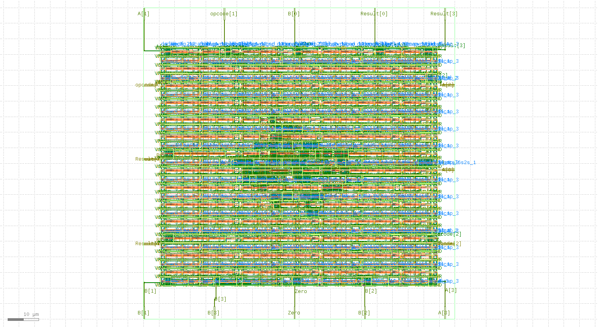

# 4-bit ALU Physical Design (RTL-to-GDSII)

This repository contains the physical implementation of a 4-bit ALU using the **OpenLane** flow and **SkyWater 130nm PDK**.

## Project Highlights
* **Core Flow:** RTL Synthesis, Floorplanning, Placement, CTS, and Routing.
* **Verification:** Successfully completed with **zero DRC/LVS violations**.
* **Layout:** Physical GDSII generated and verified using Magic VLSI and KLayout.

## Technical Summary
| Metric | Details |
| :--- | :--- |
| **PDK** | Sky130A |
| **Toolchain** | OpenLane, Magic, KLayout, Netgen |
| **Standard Cells** | sky130_fd_sc_hd |

## Layout Preview

